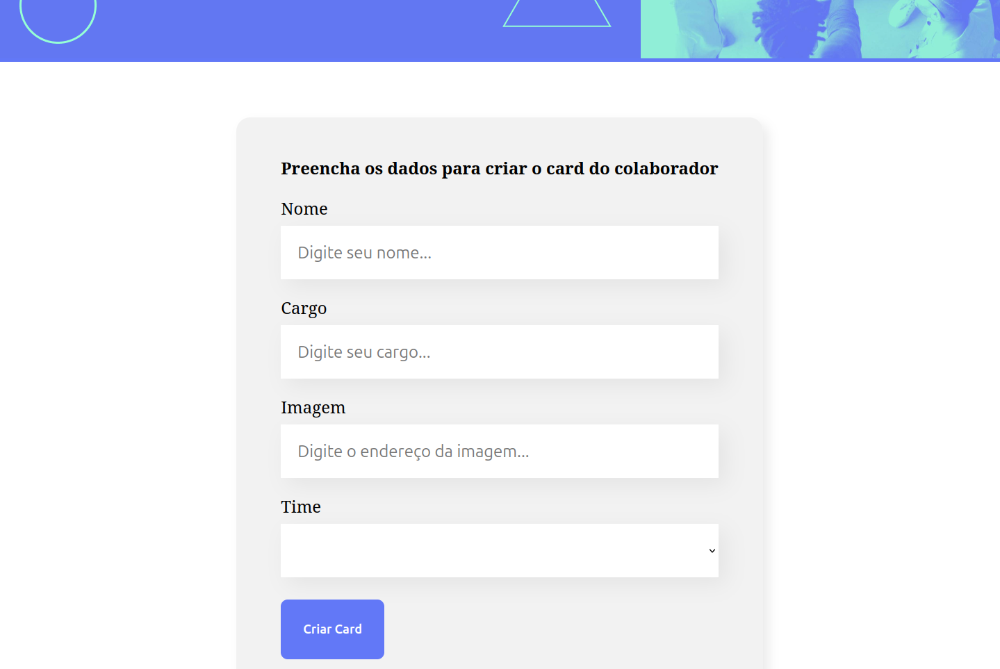
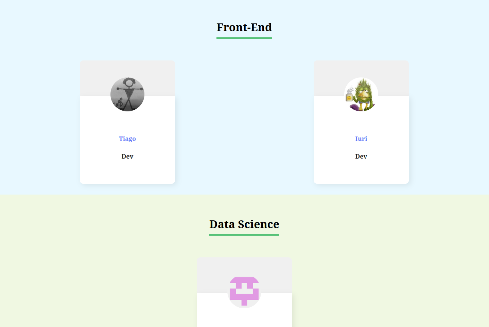

# Organo

### This project is the result of a React course I took at [Alura](https://www.alura.com.br/).


### It's a frontend app built with React and React-Query.



<br>

The app is just a list of people organized by team (Front-end, Data Science, Devops...) with a form to add new members and their photos to the teams.

You can add new members! So go ahead and add yourself and your bodies :grinning:



<br>


# Set up backend

This is a frontend application built with React and React-Query that uses data from a backend application.

So, you need to run the backend before to start this application.

Clone [the backend project](https://github.com/ti-a-go/organo-backend) and take a look at its README for information about how to run it.

# Install dependencies

Install dependencies using NPM:

```sh
npm install
```

Start development server:

```sh
npm run dev
```

And you are good to go: http://localhost:5173/


# React + Vite

This template provides a minimal setup to get React working in Vite with HMR and some ESLint rules.

Currently, two official plugins are available:

- [@vitejs/plugin-react](https://github.com/vitejs/vite-plugin-react/blob/main/packages/plugin-react/README.md) uses [Babel](https://babeljs.io/) for Fast Refresh
- [@vitejs/plugin-react-swc](https://github.com/vitejs/vite-plugin-react-swc) uses [SWC](https://swc.rs/) for Fast Refresh
